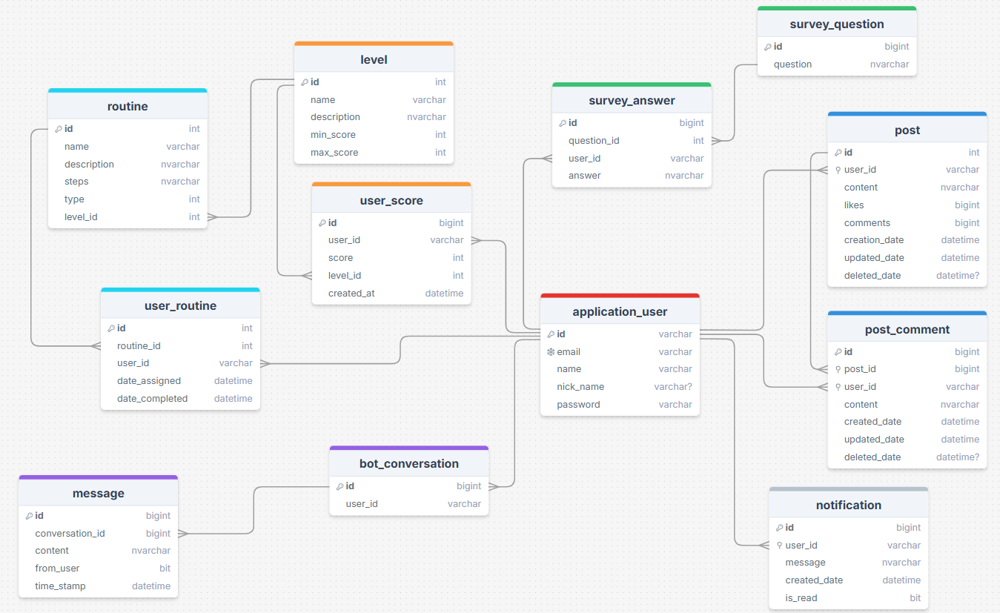

## Project Overview
**Tranquilo** is a mobile application that aims to help users manage anxiety, with a specific focus on Generalized Anxiety Disorder (GAD). The app combines routines, activities, and a social platform to foster a supportive environment where users can post updates, comments, and interact with each other. The backend is built using **C# .NET** and connects with an AI system to generate personalized routines and advice based on user profiles.

The project is structured into distinct layers following the Separation of Concerns principle. This design makes the system more maintainable, scalable, and adaptable for future features.

## Technology Stack
- **Backend Framework:** C# .NET
- **Frontend Framework:** Flutter (separate project)
- **Database:** SQL Server
- **Authentication:** JWT Token-based authentication
- **AI Module:** Integrated AI for personalizing routines and tips.
- **Tests:** Unit, Integration, and End-to-End tests.

## Project Structure and Layers
Tranquilo backend follows a layered architecture to maintain a clean separation of concerns. Each layer is responsible for a specific part of the application’s logic.

## 1. API Layer
- Exposes RESTful endpoints for the mobile app to communicate with.
- Handles HTTP requests and responses, interacting with the Business Logic layer.
- Current functionalities include:
    - **Controllers:** Defines API endpoints and handles HTTP requests. Currently, the AccountController includes endpoints for user login and registration.
    - **Migrations:** Database migration files for managing schema updates.
- **Tools:** ASP.NET Core

## 2. Business Logic Layer
- Contains the core business logic for managing profiles, posts, routines, comments, and interactions with the AI module.
- Key components include:
    - **Managers:** Handles business rules and logic
    - **DTOs (Data Transfer Objects):** Used to transfer data between layers.
    - **AutoMapper Profiles:** Used to map between DTOs and domain models.
- **Tools:** C# interfaces and services (IProfileManager, IPostManager, etc.)

## 3. Data Access Layer (DAL)
- Communicates directly with the database using Entity Framework Core.
- Maps the data models to the relational database and manages database migrations.
- It includes:
    - **Models:** Represents the database tables and their relationships.
    - **DbContext:** Entity Framework Core context to manage database connections and queries.
    - **Repositories:** Implements data access logic for CRUD operations and querying the database.
- **Tools:** SQL Server, Entity Framework Core

## 4. AI Module Layer
- A separate module that uses AI to generate personalized routines, tips, and suggestions for anxiety management.
- Integrated with the backend through API calls.

## API Documentation
The following APIs expose the functionality of the Tranquilo application backend. They handle user profiles, posts, routines, comments, and more.

### 1. AccountController
Handles user registration, login, and password management.

- POST /api/account/Register 
  - Registers a new user.
- POST /api/account/Login
   - Authenticates a user and returns a JWT token.
POST /api/account/forgot-password
   - Sends an OTP for password reset.
POST /api/account/verify-otp
   - Verifies the OTP for password reset.
POST /api/account/reset-password
  - Resets a password using the OTP.

### 2. PostController
Handles user-generated posts.

GET /api/post 
    - Retrieves all posts.
GET /api/post/{id} 
    - Retrieves a post by its ID.
GET /api/post/User/{userId} 
    - Retrieves posts by a specific user.
POST /api/post 
    - Adds a new post.
PATCH /api/post 
    - Updates an existing post.
DELETE /api/post/{id} 
    - Deletes a post by its ID.
POST /api/post/vote 
    - Votes on a post.

### 3. CommentController
Manages user comments on posts.

GET /api/comment 
    - Retrieves all comments.
GET /api/comment/{id} 
    - Retrieves a comment by its ID.
GET /api/comment/User/{userId} 
    - Retrieves comments made by a specific user.
GET /api/comment/Post/{postId} 
    - Retrieves comments on a specific post.
POST /api/comment 
    - Adds a new comment.
PATCH /api/comment 
    - Updates an existing comment.
DELETE /api/comment/{id}
    - Deletes a comment by its ID.

### 4. RoutineController
Handles user routines and associated logic.

GET /api/routine 
    - Retrieves all routines.
GET /api/routine/{id} 
    - Retrieves a routine by its ID.
GET /api/routine/LevelId/{LevelId} 
    - Retrieves routines by difficulty level.

### 5. ProfileController
Manages user profiles.

GET /api/profile/UserId/{id} 
    - Retrieves a user profile by user ID.
GET /api/profile/UserEmail/{email}
    - Retrieves a user profile by email.
PUT /api/profile 
    - Updates user profile information.
PATCH /api/profile/UserLevel/{userId} 
    - Updates user level.
DELETE /api/profile 
    - Deletes a user profile.

# AI Integration
The AI component of the Tranquilo app generates personalized routines and anxiety management suggestions. The backend communicates with this AI module, sending user data to provide relevant recommendations based on GAD parameters.

# Testing
The Tranquilo backend includes a comprehensive set of tests to ensure reliability.

## Types of Tests:
Unit Tests: Verifies individual components, like services and controllers.

Running Tests:
To execute tests, use:

```bash
dotnet test
```


# Database Overview
The Tranquilo app uses SQL Server as its database. The database stores all user-related data, including profiles, posts, comments, routines, and user activity logs.

### Key Tables:
- **Users:** Stores user profiles, authentication details, and user-level information.
- **Posts:** Contains user-generated content such as posts and associated data.
- **Comments:** Stores user comments on posts.
- **Routines:** Houses different routines, which can be customized based on user preferences.
- **Votes:** Stores voting data for posts, enabling a voting mechanism for feedback on posts.
- **Notifications:** Contains notifications sent to users for important updates or reminders.

### Database Migrations:
Migrations are managed via Entity Framework Core. New migrations can be created and applied as follows:
```bash
dotnet ef migrations add <MigrationName>
dotnet ef database update
```

## Database Scheme


### Tables:
- ***Identity tables.***
- ***BotConversation.***
- ***Level.***
- ***Message.***
- ***Notification.***
- ***Post***
- ***PostComment.***
- ***Routine.***
- ***SurveyAnswer***
- ***SurveyQuestion***
- ***UserRoutine***
- ***UserScore***


# Development Setup
## Prerequisites:
.NET SDK
SQL Server

## Installation

1. **Clone the Repo:**

   Clone the repository to your local machine:

   ```bash
   git clone https://github.com/Tranquilo-Organization/Tranquilo-Backend.git

2. **Install packages:**
   ```bash
   dotnet restore

## Configuration

In the `appsettings.json` file, the following configurations are used:
 
```json
{
  "Logging": {
    "LogLevel": {
      "Default": "Information",
      "Microsoft.AspNetCore": "Warning"
    }
  },
  "AllowedHosts": "*",
  "ConnectionStrings": {
    "DefaultConnection": "Data Source=(localdb)\\ProjectModels;Initial Catalog=Tranquilo;Integrated Security=True"
  },
  "Key": "75d19b579976fcd772a2c502b98fdaa4675f7fbda75f238eb0f0c357c574a4e2"
}
```

Navigate to the project directory:

```bash
cd TranquiloSystem
Set up the Database: Modify the connection strings in appsettings.json to point to your local or cloud SQL Server instance.
```

Run the application:
```bash
dotnet run
```
Access the API: The API can be accessed at http://localhost:5000/api. Use Postman or any API client for testing.

## Dependencies

### API Layer
- `Microsoft.AspNetCore.Authentication.JwtBearer` Version 8.0.8
- `Microsoft.EntityFrameworkCore.Design` Version 8.0.8
- `Microsoft.IdentityModel.Tokens` Version 8.0.2
- `Swashbuckle.AspNetCore` Version 6.4.0
- `System.IdentityModel.Tokens.Jwt` Version 8.0.2

### Business Logic Layer (BLL)
-  `AutoMapper` Version 13.0.1


### Data Access Layer (DAL)
- `Microsoft.AspNetCore.Identity.EntityFrameworkCore` Version 8.0.8
- `Microsoft.EntityFrameworkCore` Version 8.0.8
- `Microsoft.EntityFrameworkCore.SqlServer` Version 8.0.8
- `Microsoft.EntityFrameworkCore.Tools` Version 8.0.8


# File Structure
``` TranquiloSystem/
│
├── Controllers/
│   ├── AccountController.cs
│   ├── PostController.cs
│   ├── CommentController.cs
│   ├── ProfileController.cs
│   ├── RoutineController.cs
│
├── Models/
│   ├── Dtos/
│   ├── Entities/
│
├── Services/
│   ├── IAccountManager.cs
│   ├── IPostManager.cs
│   ├── IPostCommentManager.cs
│   ├── IProfileManager.cs
│   ├── IRoutineManager.cs
│
├── Data/
│   ├── ApplicationDbContext.cs
│   ├── Migrations/
│
├── appsettings.json
├── Program.cs
├── Startup.cs
```

### Contributing
If you'd like to contribute, please fork the repository and submit a pull request with your changes. Ensure that all tests pass and adhere to the coding guidelines.

### License
This project is licensed under the MIT License. See the LICENSE file for more details.
